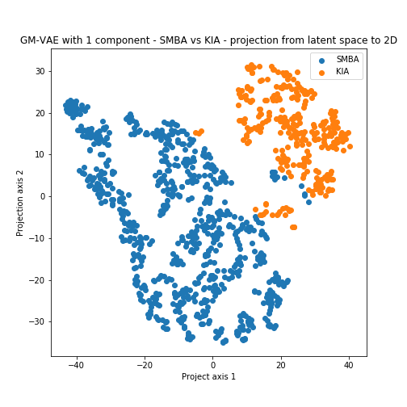
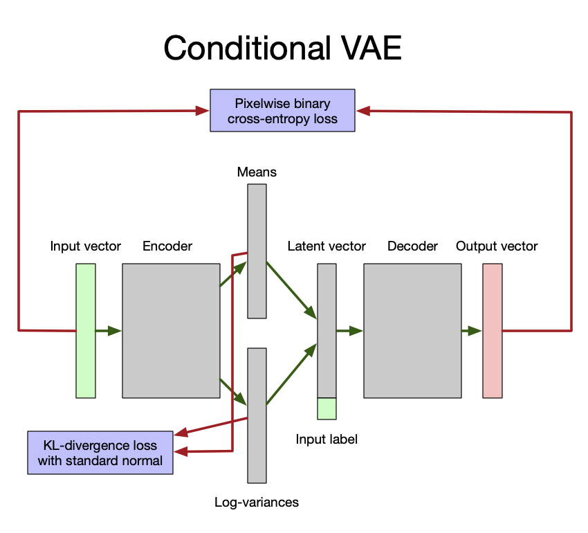
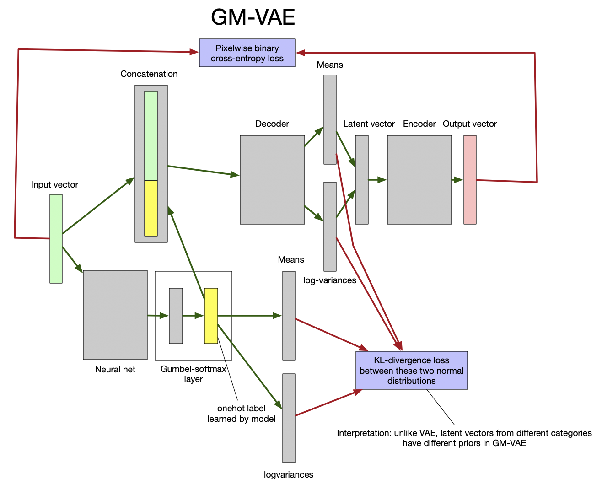

## Analysis

### GM-VAE

- Vary components from 8 (done),  28,  48,  68,  88, 108, 128, for each component
    - Create a new folder called `game_gmvae_n`, where `game` can be `smba` or `kia` and `n` is the number of components.
    - Train model for 100 epochs.
    - Save model.
    - Generate 10,000 chunks and save as a JSON in `./game_generations`.

## Results

### Clustering for SMBA vs KIA

 | 
:-------------------------:|:-------------------------:

### Comparison between CVAE and GMVAE
 | 
:-------------------------:|:-------------------------:
